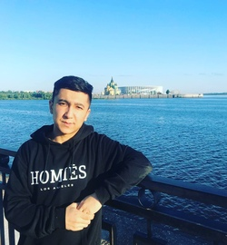

## Shukur Matibragimov

### Junior Frontend-developer

### Contact me

- Discord - @shukur
- Telegram - @shukurnonstop
- Email - matibragimov@mail.ru
- Phone - +79677144435

### About myself

I am an ambitious and hardworking individual, who wants to create and develop in sphere of frontend development. As well, I am adept at handling multiple tasks on a daily basis.
My key strength is communication; building strong relationships with people in order to deliver the best results.

#### Experience

June 2021- Aug 2021 English Teacher at camp "New Generation" (Tashkent, Uzbekistan)

* creating strategies for children
* writing and creating audio and video materials for camp events
* organizing different games and activities for kids

June 2022 - Aug 2022 DJ at "Ostrov Priklyucheniy"(Nizhny Novgorod, Russia)

* DJ'd over 40 events
* created unique playlists for guests
* assisted with setup and breakdown of musical equipment

### Code example

```
function snakeBypass(matrix) {
console.log("\nSnake bypass:");

for (let i = 0; i < matrix.length; i++) {
for (let j = 0; j < matrix[i].length; j++) {
let columnIdx = i % 2 === 0 ? j : matrix[i].length - j - 1;
console.log(matrix[i][columnIdx]);
}
}
}
```

#### Education & courses

2019 - present.

Bachelor in jurisprudence. University of HIGHER SCHOOL OF ECONOMICS (Nizhny Novgorod, Russia)

- Web-development. Frontend on stepik.org (in progress)
- Javascript Manual learnjavascript.ru (in progress)
- RS Schools Course «JavaScript/Front-end. Stage 1» (in progress)

### Languages

- Uzbek (native)
- Russian (fluent)
- English (fluent)

> Dreams don't work unless you do - John C.Maxwell
